# Plugin Stats

## Overall: 1,720+ active installs

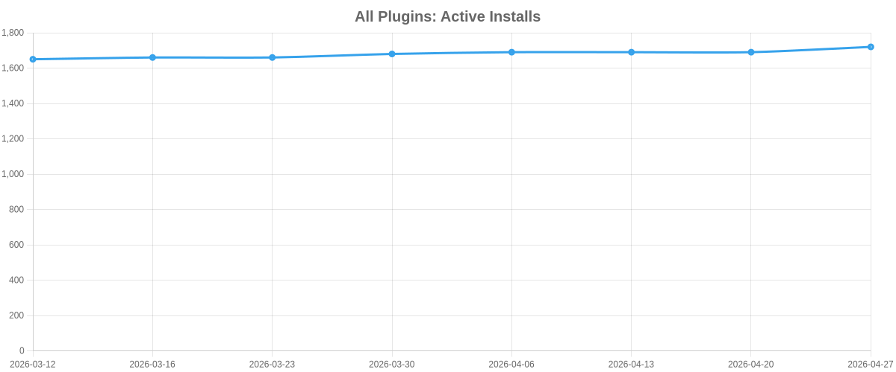

## By Plugin

### Taxonomy Tags To Checkboxes — 1,000+ active installs

[View on Plugin Directory](https://wordpress.org/plugins/runthings-taxonomy-tags-to-checkboxes/)

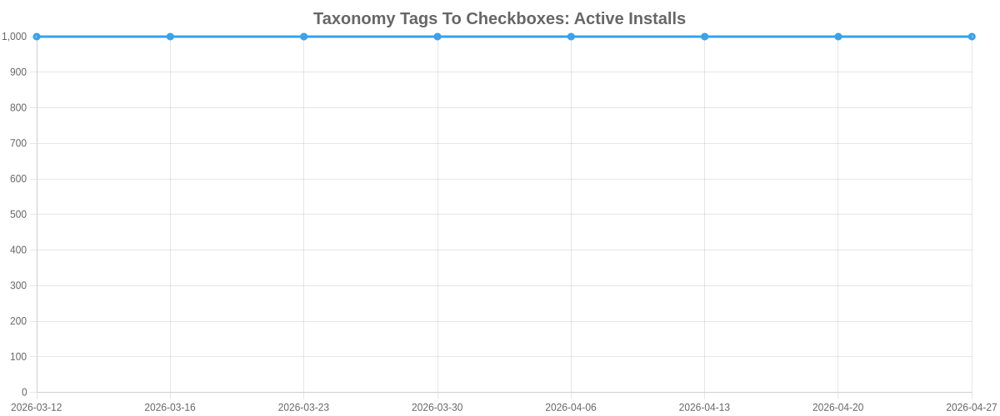

### Bulk Page Stub Creator — 500+ active installs

[View on Plugin Directory](https://wordpress.org/plugins/bulk-page-stub-creator/)

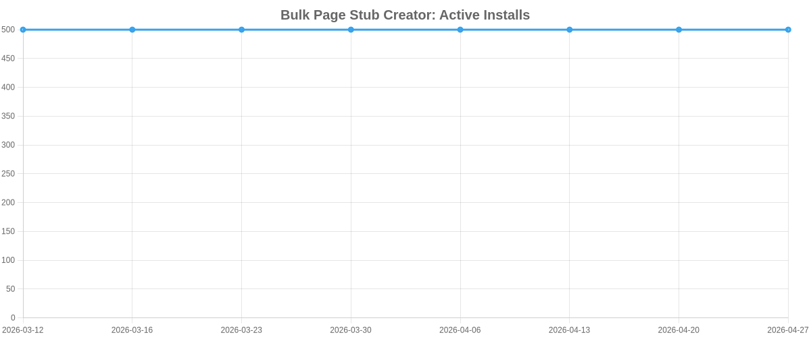

### Jsf Apply Button Scroll To Top — 80+ active installs

[View on Plugin Directory](https://wordpress.org/plugins/runthings-jsf-apply-button-scroll-to-top/)

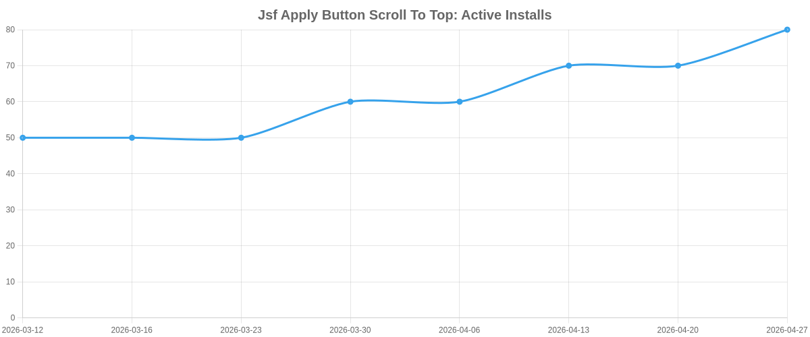

### Current Year Shortcode — 70+ active installs

[View on Plugin Directory](https://wordpress.org/plugins/runthings-current-year-shortcode/)

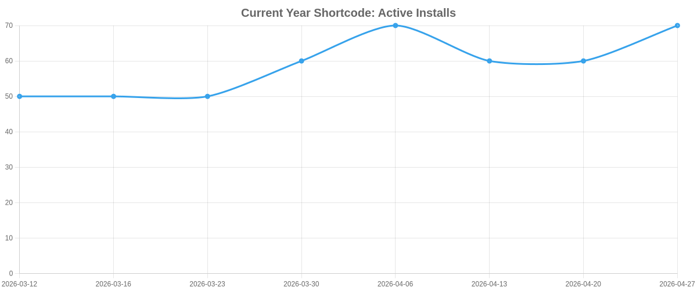

### Wc Coupons Role Restrict — 60+ active installs

[View on Plugin Directory](https://wordpress.org/plugins/runthings-wc-coupons-role-restrict/)

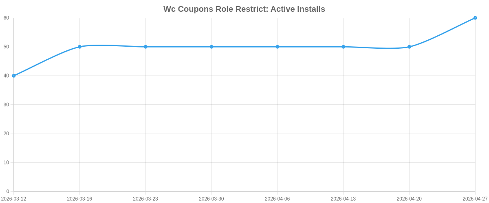

### Secrets — 10+ active installs

[View on Plugin Directory](https://wordpress.org/plugins/runthings-secrets/)

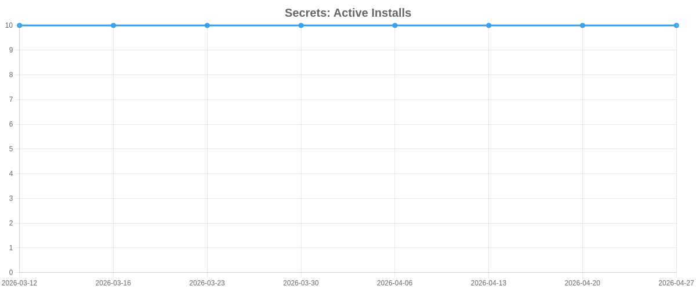

### Category Children Coupons — 0+ active installs

[View on Plugin Directory](https://wordpress.org/plugins/runthings-category-children-coupons/)

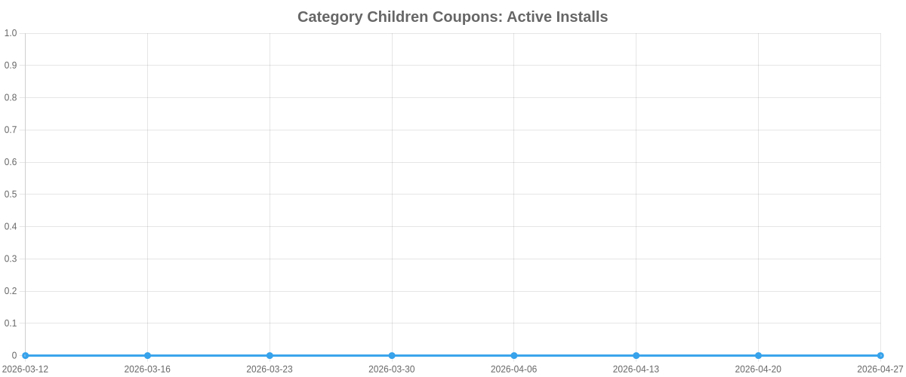

### Empty Media Title — 0+ active installs

[View on Plugin Directory](https://wordpress.org/plugins/runthings-empty-media-title/)

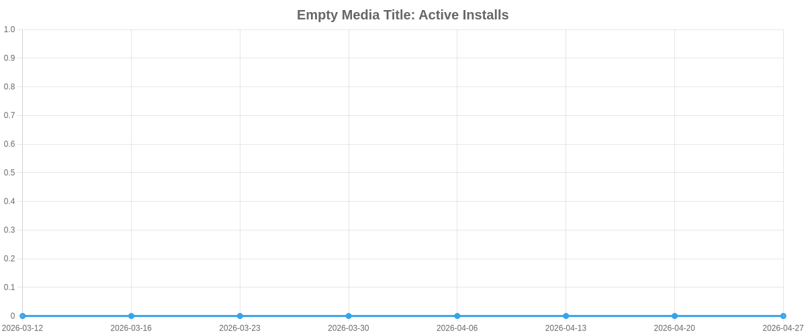

### Taxonomy Template Selector — 0+ active installs

[View on Plugin Directory](https://wordpress.org/plugins/runthings-taxonomy-template-selector/)

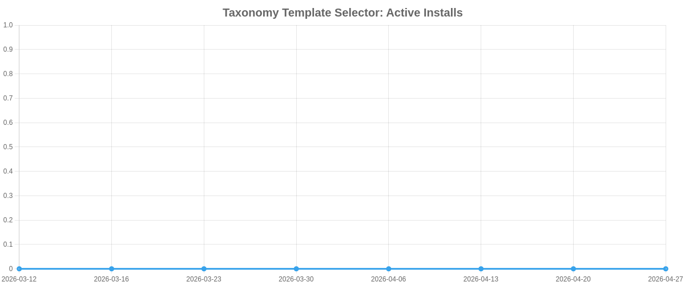

### Wc Coupons Required Products — 0+ active installs

[View on Plugin Directory](https://wordpress.org/plugins/runthings-wc-coupons-required-products/)

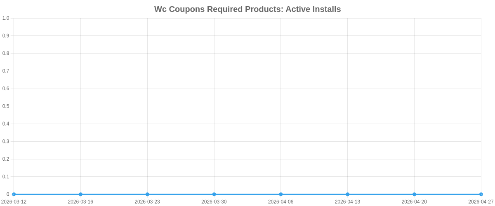

### Wc Order Departments — 0+ active installs

[View on Plugin Directory](https://wordpress.org/plugins/runthings-wc-order-departments/)

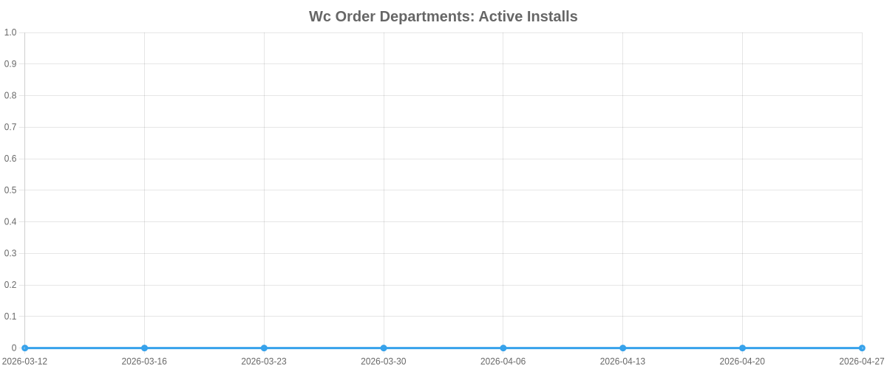
